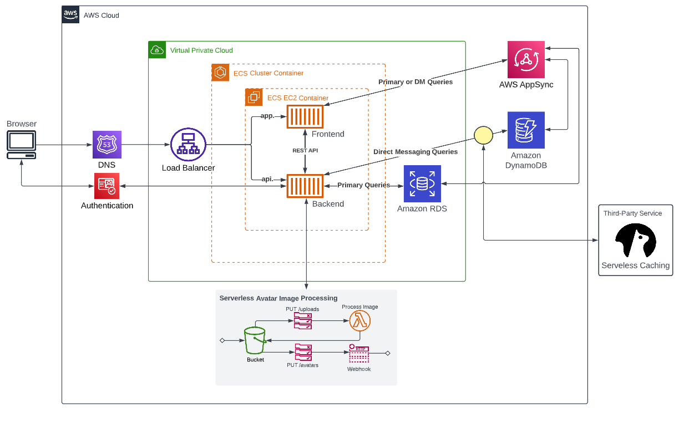

# Week 0 — Billing and Architecture

## Pre-requistes
 
I created a github repository and integrated the gitpod extension

Bought a DNS : 

It doesn't matter where you buy your domain as long as you can update Nameservers to point to AWS when we need to do that, comparing to Route53 I found a cheaper provider from https://www.namecheap.com/ for 6$ per year, so now I have a DNS called: aminerayes.com 

Created a honeycomb account

Created a rollbar account

## Created my AWS account:

## Security recommendation : 
Setting up the MFA in IAM for the root user


Destroyed my root account credentials, Set MFA, IAM role (later after modification)

## Set a billing alarm, set a AWS budget and AWS credantials :
### 1st method from the AWS console:

#### Billing Alarm : 
Step 1 : from console search for billing to show the dashboard, not all the services have the same pricing in all the regions (so select the right region for the services you are using in my case us-east-1 virginia by default). Go to bills to show your bills, and go to billing preferences to set it up the billing (receive pdf invoice by email, receive free tier usage alerts, receive billing alerts). 
Step 2 : manage billing alert using cloudwatch, then create an alarm (billing —> total estimated charges —> metric name : AWS Bootcamp Cruddur 2023 Alert and set budget 10$ —> create a new sns topic from notification section —> Alarm name : Billing Alarm (now I amm left with 9 alarms (10 free amazon cloudwatch alarms in total)).

#### AWS Budget :
Created from Budget a monthly cost budget gave it a name, and my email and then chose the budget amount 10$.

#### Cost allocation tags : 
not yet maybe I'll use it later when I create for example a dev and a prod environment for EC2 instance
#### Cost explorer : 
not yet, advanced feature (to prepare reports to finance team etc...)
#### Credit :
In case I get a voucher 
#### reminder : It's very important to check the prices per hour for EC2, then I can estimate cost using the aws calculator (for month cost), and check AWS free tier for free services

### AWS credentials :
We are doing this to ensure security so it is highly recommended (to not troubleshoot access to some things).
Created a user group, added an admin user to that group after changing the alias, and changing the password (after login as IAM user).


Then created access keys for my user

Finally I added MFA for more security for the admin user

Got familiarized with Cloudshell from my console and it works fine


### 2nd method from the Gitpod environment:
#### install AWS CLI
At first we need to install the AWS CLI on gitpod so we can find it in Vscode when we lanuch our workspace.
Commands on linux
```
curl "[https://awscli.amazonaws.com/awscli-exe-linux-x86_64.zip](https://awscli.amazonaws.com/awscli-exe-linux-x86_64.zip)" -o "awscliv2.zip"
```
```
unzip awscliv2.zip
```

this will download a bash script in install file ./aws/install
then we need to run this program :
```
sudo ./aws/install
```


after that run /usr/local/bin/aws 


in order to make it persistent for gitpod each time we reuse it replace export with gp env, then add the gitpod.yml new configuration :
```YAML
tasks:
  - name: aws-cli
    env:
      AWS_CLI_AUTO_PROMPT: on-partial
    init: |
      cd /workspace
      curl "https://awscli.amazonaws.com/awscli-exe-linux-x86_64.zip" -o "awscliv2.zip"
      unzip awscliv2.zip
      sudo ./aws/install
      cd $THEIA_WORKSPACE_ROOT
vscode:
  extensions:
    - 42Crunch.vscode-openapi
```
finally commit and push the changes and go check on repo and gitpod.io that it’s running (sometimes gitpod don’t save changements if it's not running)
#### Setup a Budget and Billing alarm via CLI
To do that at first we create aws/json and then add this two configuration files found on the link bellow :
[AWS template link to set a budget and a billing alarm](https://awscli.amazonaws.com/v2/documentation/api/latest/reference/budgets/create-budget.html#examples)

aws-budget.json 
```YAML
{
    "BudgetLimit": {
        "Amount": "10",
        "Unit": "USD"
    },
    "BudgetName": "Example Tag Budget",
    "BudgetType": "COST",
    "CostFilters": {
        "TagKeyValue": [
            "user:Key$value1",
            "user:Key$value2"
        ]
    },
    "CostTypes": {
        "IncludeCredit": true,
        "IncludeDiscount": true,
        "IncludeOtherSubscription": true,
        "IncludeRecurring": true,
        "IncludeRefund": true,
        "IncludeSubscription": true,
        "IncludeSupport": true,
        "IncludeTax": true,
        "IncludeUpfront": true,
        "UseBlended": false
    },
    "TimePeriod": {
        "Start": 1477958399,
        "End": 3706473600
    },
    "TimeUnit": "MONTHLY"
}
```
aws-notifications-with-subscribers.json 
```
[
    {
        "Notification": {
            "ComparisonOperator": "GREATER_THAN",
            "NotificationType": "ACTUAL",
            "Threshold": 80,
            "ThresholdType": "PERCENTAGE"
        },
        "Subscribers": [
            {
                "Address": "put your email here",
                "SubscriptionType": "EMAIL"
            }
        ]
    }
]
```
Finally run this in the main of the repo :

```
ACCOUNT_ID=$(aws sts get-caller-identity --query Account --output text)
```
```
aws budgets create-budget \
--account-id $ACCOUNT_ID \
--budget file://aws/json/aws-budget.json \
--notifications-with-subscribers file://aws/json/aws-budget-notifications-with-subscribers.json
```
PS: we can also add an env var : gp env AWS_ACCOUNT_ID="my-id-:p"
Finally I have created 2 budgets so I don't have free remaining budgets (Beyond free tier each budget will cost 3.10USD per month)
### Creating SNS topic and SNS subscription :
I created SNS topic and subscription in order to receive alarms when we exceed the budget, we can do it from the Console or the AWS CLI.

SNS topic :


SNS subscription :


If you want to create it from the AWS CLI :
```
aws sns create-topic --name billing-alarm
```
It will create a topic ARN (Amazon Resource Names)

for the sns subscription 
```
aws sns subscribe \
    --topic-arn="TopicARN" \
    --protocol=email \
    --notification-endpoint=putmyemail@mail.com
```



