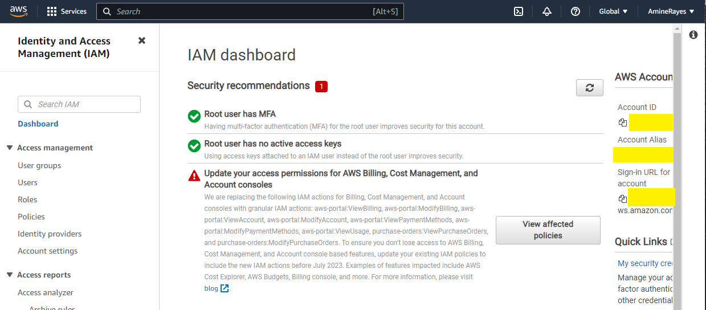

# Week 0 — Billing and Architecture

Pre-requistes
 
I created a github repository and integrated the gitpod extension

bought a DNS : 
There are domains under a dollar out there that you can get.
It doesn't matter where you buy your domain as long as you can update Nameservers to point to AWS when we need to do that
https://www.namecheap.com/ , so now I have a DNS : aminerayes.com 

Created a honeycomb account (I still don't know why)

Created a rollbar account

Created my AWS account:
Setting up the MFA in IAM for the root user

Destroy your root account credentials, Set MFA, IAM role

Set a billing alarm, set a AWS budget
1st method from the AWS console:

Billing Alarm : from console search for billing to show the dashboard, not all the services have the same pricing in all the regions (so select the right region for the services you are using)
go to bills to show your bills, and go to billing preferences to set it up the billing (receive pdf invoice by email, receive free tier usage alerts, receive billing alerts), step 2 manage billing alert using cloudwatch, then create an alarm (billing —> total estimated charges —> metric name : AWS Bootcamp Cruddur 2023 Alert and set budget 10$ —> create a new sns topic from notification section —> Alarm name : Billing Alarm (now i’m left with 9 alarms (10 free amazon cloudwatch alarms in total))

