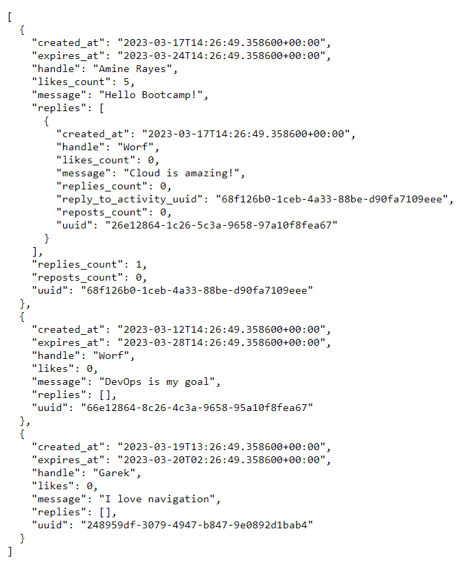

# Week 1 — App Containerization
In this phase we need to start building our infrastructure for our application, we have a frontend created with nodejs and backend with python-flask

## Technical Tasks

we are going to:
Launch the repo within a Gitpod workspace
Configure Gitpod.yml configuration, eg. VSCode Extensions
Clone the frontend and backend repo
Explore the codebases
Ensure we can get the apps running locally
Write a Dockerfile for each app
Ensure we get the apps running via individual container
Create a docker-compose file
Ensure we can orchestrate multiple containers to run side by side
Mount directories so we can make changes while we code

## Challenges    

Run the dockerfile CMD as an external script
Push and tag a image to DockerHub (they have a free tier)
Use multi-stage building for a Dockerfile build
Implement a healthcheck in the V3 Docker compose file
Research best practices of Dockerfiles and attempt to implement it in your Dockerfile
Learn how to install Docker on your localmachine and get the same containers running outside of Gitpod / Codespaces
Launch an EC2 instance that has docker installed, and pull a container to demonstrate you can run your own docker processes. 

## Application containerization
First of all we need to understand the docker architecture,, here bellow a simple explanation credits to EDITH PUCLLA from linkedin 


Docker Extension :

Added a docker extension on gitpod and installed all the dependencies required

## Containerize the Backend

n ou application we have a backend application developped using the framework flask of python, from the command line we can start by running this commands in the backend-flask directory

```
cd backend-flask
export FRONTEND_URL=""
export BACKEND_URL=""
python3 -m flask run --host=0.0.0.0 --port=4567
cd ..
```
we make sure to unlock the port from the port tab to make it accessible on our browser

these commands adds an environment variables and runs the application, so next step we start working on the dockerfile.

Go to backend-flask directory and add a dockerfile :


Before running the container we will check the steps, we start by installing flask dependencies and run the server on Gitpod :


This command will install the dependencies, that will install python packages that we have in the requirements.txt file using the pip3 package manager. we can use the —quiet option to suppress the packages details from python

```
pip3 install -r requirements.txt --quiet
```
Then we use this command to run the python 3 interpreter , -m flask means that the Python interpreter will run the Flask module as a script, run will start the Flask development server, —host=”0.0.0.0” this option allows the Flask development server to be accessible anywhere from outside the container (we need to improve this later to secure our server from intrusion, a vulnerability can be exploited here be careful !), —port=4767 this option specifies the port number that the Flask development server should listen on.

```
python3 -m flask run --host="0.0.0.0" --port=4567
```
Unlock the URl from Ports 

We need to unlock this on Gitpod to give access to the server from the URL provided


Not found error (404)

We got a error 404 because we didn’t specifiy the endpoint (root route / does not exist in the server). Therefore, the server is unable to find the requested resource.


Internal server error (500)

We add the endpoint /api/activities/home , after that we got a error 500, because we have to specifiy the environment variables that allow the server to function correctly.


To fix this we have to add two environment variables used to enable Cross-Origin Resource Sharing (CORS) requests for the flask application :

```
export BACKEND_URL="*"
export FRONTEND_URL="*"
```
Here is the result after setting the environment variables



flask-backend image build

Go to flask_backend folder and run this command

```
docker build -t backend-flask .
```
docker build : used to build a Docker image. it builds the layers of the Dockerfile and gives as an image 

-t backend-flask : this flag -t means tag we name our image and tagged to be assigned to the resulting docker image which is flask-backend

. : means it means tha the dockerfile is locate in the current directory


In our case we got 8 steps or layers that dockerfile has to build all the dependecies, we didn’t specify the tag so that’s why by default it’s latest (we can change that if we wish have versions of the image)


we can use docker images command to show the images we built

Now we can run the backend-flask image using docker run command

```
docker container run --rm -p 4567:4567 -d backend-flask
```
docker container run : this command runs the Docker container.

—rm : is a remove option, we use it to remove automatically the container when it stops running, in order to keep the environment clean and not having problem when want to do a modification in the docker container and run it again

—p 4567:4567 : this option publish the host port 4567 to the container port 4567. This means that any traffic sent to port 4567 on the host machine will be forwarded to port 4567 in the container. This is useful for exposing network services running inside the container to the host machine or to the outside world.

-d : is for detached mode, which means runs in the background and frees up the terminal.

backend-flask : this is the name of our image that we use to create the container.


we we open the URL for the backend server we got this TypeError page, this is because we forget to add the environment variables 


To add the environment variables we can do it in the command line 

```
export FRONTEND_URL=""
export BACKEND_URL=""
```
and then we add the option -e for environment variables in the docker run command like this 

```
docker container run --rm -p 4567:4567 -it -e FRONTEND_URL -e BACKEND_URL backend-flask
```
We can also add them directly from the CLI in the docker run command without exporting them in advance
```
docker run --rm -p 4567:4567 -it -e FRONTEND_URL='*' -e BACKEND_URL='*' backend-flask
```
here bollow the result of the command, so finally we have created the container for our backend-flask applciation


Listing containers
```
docker ps
```
the docker container ps command is to list the currently running Docker containers on our system, ps stands for “process status”, and it provides a list 

The `docker container ps` command is used to list the currently running Docker containers on your system. The `ps` stands for **"process status"**, and it provides a list of all the active containers along with their relevant details such as the container ID, image used to create the container, container status, name of the container, and the ports exposed by the container.

By default, docker container ps lists only the running containers. However, you can use various options with this command to customize the output. For example, you can use the `-a` or `--all` option to list all the containers, including the ones that have exited. You can also use the `--filter` option to filter the list of containers based on specific criteria such as container name, ID, or status.

In summary, the docker container ps command is useful for monitoring the status of Docker containers and for troubleshooting issues related to containerization.

here is the output of the command


Troubleshooting 

To check if the environment variables are set, we can view the logs generated by the container:
```
docker container logs <CONTAINER_ID>
```
## Containerize the frontend

We create a dockerfile in the directory frontend-react-js

```YAML
FROM node:16.18
ENV PORT=3000 
COPY . /frontend-react-js
WORKDIR /frontend-react-js
RUN npm install
EXPOSE ${PORT}
CMD ["npm", "start"]
```
We build the container like we did before with the backend docker, and before running the docker image we need to install all the dependencies specified in the package.json file for the React.js application.

Therefore, we run this command
```
npm i
```
This command will download and install all the required dependencies and store them in a node_modules directory in the same directory as the package.json file. These dependencies may include various React.js libraries, CSS frameworks, or other packages that the application depends on.

Once these two commands are run, the necessary dependencies for the React.js application should be installed and the application should be ready to run.

## Docker Compose

In order to run multiple containers at the sametime without going to each application and running its container, we can assemble the frontend and the backend at the same place and build it together

that’s the purpose of using docker compose, from the root directory of the project, we create this docker-compose.yml file

```YAML
version: "3.8"
services:
  backend-flask:
    environment:
      FRONTEND_URL: "https://3000-${GITPOD_WORKSPACE_ID}.${GITPOD_WORKSPACE_CLUSTER_HOST}"
      BACKEND_URL: "https://4567-${GITPOD_WORKSPACE_ID}.${GITPOD_WORKSPACE_CLUSTER_HOST}"
    build: ./backend-flask
    ports:
      - "4567:4567"
    volumes:
      - ./backend-flask:/backend-flask
  frontend-react-js:
    environment:
      REACT_APP_BACKEND_URL: "https://4567-${GITPOD_WORKSPACE_ID}.${GITPOD_WORKSPACE_CLUSTER_HOST}"
    build: ./frontend-react-js
    ports:
      - "3000:3000"
    volumes:
      - ./frontend-react-js:/frontend-react-js

networks: 
  internal-network:
    driver: bridge
    name: cruddur
```
we can run the docker-compose.yml file using this command
```
docker compose up
```
## Adding a notification feature
done


## OpenApi notifications
done


## Install Postgres on Gitpod
done

## Containerize the DynamoDb local
done

## Containerize the PostgreSQL
done

