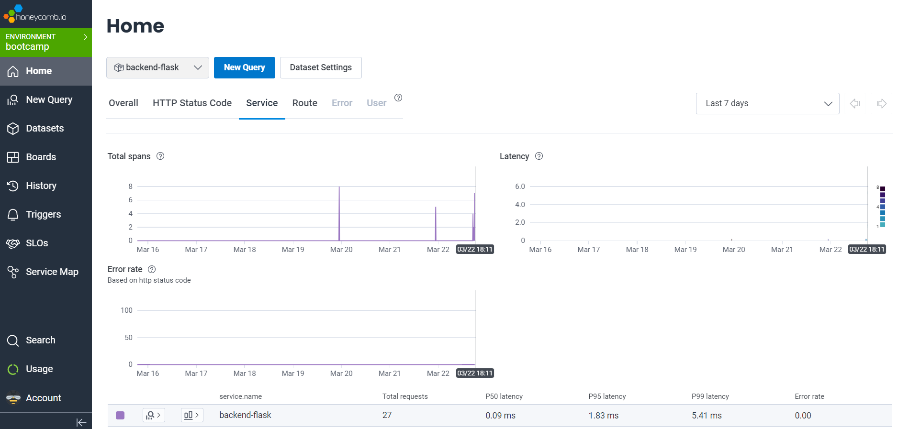

# Week 2 — Distributed Tracing

## What is the distributed tracing ?

A program is something that you can run and test on your software and a software is another thing bigger, that is probably running in the cloud that connects to other software and actual people but they are harder to track because it is not deterministic (there is file systems that get full, network disconnection, othher dependencies etc...) that makes more requests to handle, so for programs there is a debugger and for softwares there is observability, and the Software gets really complicated and goes bigger and bigger, that is why we always need to know what is going on.

In the past we have logs for our programs in a file log, but when we get a lot of services happening a bunch of separated log lines cannot trace it, so we need a story of what happened, that is what we call distributed tracing, as the request goes to different systems we can get more information (especially for the backend), and that is what we call modern observability.

## Instrumentation using Honeycomb

The goal is to have Spans, which are part of a trace, it has a start time and a duration, represents a single unit of work, and you can see what is happening exactly in more details (for example what SQl query is executing in the database).

Therefore traces tell you what happened and when it happened at the same time. as your system building is going bigger these traces will help you understand what is going on (you can see how long a database queries happened, you can see where an error happened and what service and how we get to that service).

We can also have service map for visual tracing but this feature is not free!

Instrumentation is the code that sends the data to make these traces.

That is why we will try to use Honeycomb because it is easier for observability (loging, tracing..), in a second part we will try AWS X-ray service which is more harder to implement but very useful.

## Honeycomb.io setup
In this part, we will instrument our backend flask application to use Open Telemetry (OTEL) with Honeycomb.io as the provider and run queries to explore traces within Honeycomb.
In honeycomb we have environment section, we can use it if we have a dev, staging, prod environment.
First of all we setup an environment API key and we name our environment bootcamp.

Add python dependencies into our `requirements.txt` file and install them
```
flask 
flask-cors

opentelemetry-api 
opentelemetry-sdk 
opentelemetry-exporter-otlp-proto-http
opentelemetry-instrumentation-flask 
opentelemetry-instrumentation-requests
```
Install Dependencies 
```sh
pip3 install -r requirements.txt
```
Then we add a service name in the docker-compose file to make it persistent
```sh
version: "3.8"
services:
  backend-flask:
    environment:
      FRONTEND_URL: "https://3000-${GITPOD_WORKSPACE_ID}.${GITPOD_WORKSPACE_CLUSTER_HOST}"
      BACKEND_URL: "https://4567-${GITPOD_WORKSPACE_ID}.${GITPOD_WORKSPACE_CLUSTER_HOST}"
      # OpenTelemetry environment variables 
      # This is what determines the service name in the spans that get sent to your application. 
      OTEL_SERVICE_NAME: "backend-flask"       
      # this is the honeycomb endpoint used to send data
      OTEL_EXPORTER_OTLP_ENDPOINT: "https://api.honeycomb.io"
      # this variable is used to set additional headers in the OTLP requests sent by the exporter. 
      # This can be useful in cases where the backend system requires additional authentication, 
      # authorization or metadata information to be sent in the headers.
      OTEL_EXPORTER_OTLP_HEADERS: "x-honeycomb-team=${HONEYCOMB_API_KEY}" 
...
```
Add instrumentation code to our backend 
```python
# Honeycomb.io
from opentelemetry import trace
from opentelemetry.instrumentation.flask import FlaskInstrumentor
from opentelemetry.instrumentation.requests import RequestsInstrumentor
from opentelemetry.exporter.otlp.proto.http.trace_exporter import OTLPSpanExporter
from opentelemetry.sdk.trace import TracerProvider
from opentelemetry.sdk.trace.export import BatchSpanProcessor
from opentelemetry.sdk.trace.export import ConsoleSpanExporter, SimpleSpanProcessor

# Honeycomb.io 
# Initialize tracing and an exporter that can send data to Honeycomb
provider = TracerProvider()
processor = BatchSpanProcessor(OTLPSpanExporter())
provider.add_span_processor(processor)

# Show this in the logs within the backend-flask app (STDOUT)
simple_processor = SimpleSpanProcessor(ConsoleSpanExporter())
provider.add_span_processor(simple_processor)

trace.set_tracer_provider(provider)
tracer = trace.get_tracer(__name__)

app = Flask(__name__)

# Honeycomb.io 
# Initialize automatic instrumentation with Flask
FlaskInstrumentor().instrument_app(app)
RequestsInstrumentor().instrument()
```

Create Honeycomb environment


#### Run queries to explore traces within Honeycomb.io
Query new data and show on Honeycomb dashboard

#### Creating a tracer for a module manually
[Acquiring a Tracer](https://docs.honeycomb.io/getting-data-in/opentelemetry/python/#acquiring-a-tracer)

```python
Adding a tracer to the `home_activities.py` file
from opentelemetry import trace    # <------ add this

# the trace is usually named after the module or the file name
# since the file is `home_activities.py` we named the trace `home_activities`
# alternatively we can name it "home.activities
tracer = trace.get_tracer("home.activities") # <------ add this


class HomeActivities:
  def run():
    with tracer.start_as_current_span("home-activities-mock-data"):
      # do something
      span = trace.get_current_span() # gets a reference to the current span it's in 
      now = datetime.now(timezone.utc).astimezone()

      span.set_attribute("app.now", now.isoformat())


      results = [{
        'uuid': '68f126b0-1ceb-4a33-88be-d90fa7109eee',
        'handle':  'Amine Rayes',
        'message': 'Cloud is very fun!',
        'created_at': (now - timedelta(days=2)).isoformat(),
        'expires_at': (now + timedelta(days=5)).isoformat(),
        'likes_count': 5,
        'replies_count': 1,
        'reposts_count': 0,
        'replies': [{
          'uuid': '26e12864-1c26-5c3a-9658-97a10f8fea67',
          'reply_to_activity_uuid': '68f126b0-1ceb-4a33-88be-d90fa7109eee',
          'handle':  'Worf',
          'message': 'Hello bootcamp!',
          'likes_count': 0,
          'replies_count': 0,
          'reposts_count': 0,
          'created_at': (now - timedelta(days=2)).isoformat()
        }],
      },
      {
        'uuid': '66e12864-8c26-4c3a-9658-95a10f8fea67',
        'handle':  'Worf',
        'message': 'Datascientest',
        'created_at': (now - timedelta(days=7)).isoformat(),
        'expires_at': (now + timedelta(days=9)).isoformat(),
        'likes': 0,
        'replies': []
      },
      {
        'uuid': '248959df-3079-4947-b847-9e0892d1bab4',
        'handle':  'Garek',
        'message': 'My dear doctor, I am just simple tailor',
        'created_at': (now - timedelta(hours=1)).isoformat(),
        'expires_at': (now + timedelta(hours=12)).isoformat(),
        'likes': 0,
        'replies': []
      }]

      span.set_attribute("app.result_length", len(results))
      return results
```




From New query we can visualize : COUNT where : attribute value Groupeby: trace.trace_id, this will query over all the spans in honeycomb (we expect to have two spans as found before).

## AWS-Xray

AWS X-Ray is similar to honeycomb a built in solution in AWS, trying to instrument it is challenging and more difficult than honeycomb.
We need to configure the X-Ray daemon, X-Ray SDk and other clients like AWS SDK or AWS CLI. Then do manipulations from the console.

### Installing AWS X-Ray SDK

We install it in requirements in the backend-flask
```
aws-xray-sdk
```
then from terminal we install the dependencies
```
pip install -r requirements.txt
```
then adding a middleware
```python
# X-RAY

from aws_xray_sdk.core import xray_recorder
from aws_xray_sdk.ext.flask.middleware import XRayMiddleware

# starting X-Ray recorder
xray_url = os.getenv("AWS_XRAY_URL")
xray_recorder.configure(service='backend-flask', dynamic_naming=xray_url)
XRayMiddleware(app, xray_recorder)
```
##### Create `aws/json/x-ray.json` file 
```json
{
    "SamplingRule": {
        "RuleName": "Cruddur",
        "ResourceARN": "*",
        "Priority": 9000,
        "FixedRate": 0.1,
        "ReservoirSize": 5,
        "ServiceName": "backend-flask",
        "ServiceType": "*",
        "Host": "*",
        "HTTPMethod": "*",
        "URLPath": "*",
        "Version": 1
    }
  }
```

##### Create an X-Ray Group
Groups are collections of traces that are defined by a filter expression. Use groups to filter service maps, traces, or analytics. By default, you can create up to 25 groups in addition to the default group. To add more, request an increase with AWS Support.

```sh
aws xray create-group \
   --group-name "Cruddur" \
   --filter-expression "service(\"backend-flask\")"
```


##### Create Sampling Rule 
```sh
aws xray create-sampling-rule --cli-input-json file://aws/json/xray.json
```


Sampling AWS console view


#### Configure and provision X-Ray daemon within docker-compose and send data back to X-Ray API

##### Add AWS X-Ray environment variables to `backend-flask` service 
```sh
# docker-compose.yml
version: "3.8"
services:
  backend-flask:
    environment:
      ...
      # AWS X-Ray
      AWS_XRAY_URL: "*4567-${GITPOD_WORKSPACE_ID}.${GITPOD_WORKSPACE_CLUSTER_HOST}*"
      AWS_XRAY_DAEMON_ADDRESS: "xray-daemon:2000"
```

##### Add AWS X-Ray Daemon to `docker-compose.yml`
```sh
version: "3.8"
services: 
  ...
  xray-daemon:
    image: "amazon/aws-xray-daemon"
    environment:
      AWS_ACCESS_KEY_ID: "${AWS_ACCESS_KEY_ID}"
      AWS_SECRET_ACCESS_KEY: "${AWS_SECRET_ACCESS_KEY}"
      AWS_REGION: "us-east-1"
    command:
      - "xray -o -b xray-daemon:2000"
    ports:
      - 2000:2000/udp
```

#### Observe X-Ray traces within the AWS Console


## WatchTower
#### Install WatchTower and write a custom logger to send application log data to CloudWatch Log group

Add `watchtower` package to `requirements.txt` 
```sh
# requirements.txt
...
watchtower 
```

Add dependencies to `app.py` 
```python
import watchtower 
import logging 
from time import strftime
```

Add watchtower instrumentation
```python
# CloudWatch 
# Configuring Logger to Use CloudWatch
LOGGER = logging.getLogger(__name__)
LOGGER.setLevel(logging.DEBUG)
console_handler = logging.StreamHandler()
cw_handler = watchtower.CloudWatchLogHandler(log_group='cruddur')
LOGGER.addHandler(console_handler)
LOGGER.addHandler(cw_handler)
LOGGER.info("HomeActivities")
LOGGER.info("test Log")


app = Flask(__name__)

@app.route("/api/activities/home", methods=['GET'])
def data_home():
  data = HomeActivities.run(logger=LOGGER) # use this when logging
  return data, 200
```


Add logger to `home_activities.py`
```python 
class HomeActivities:
  def run(logger):
    logger.info("HomeActivities")
    ...
```


